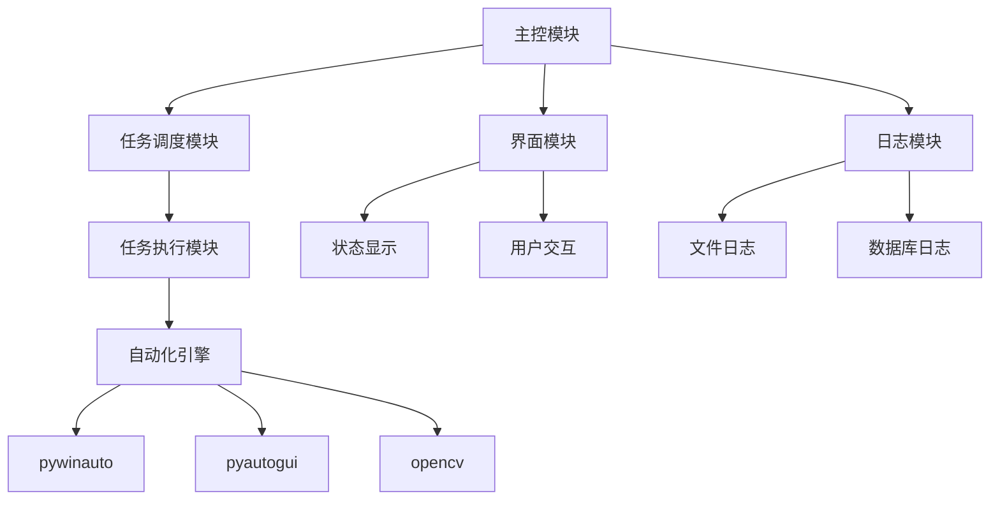

# 自动化操作桌面应用程序设计

## 1. 项目概述

### 1.1 项目背景

在当前的生产环境中，许多操作仍然依赖于人工在桌面应用程序上进行重复性的点击、输入和数据上报。这不仅效率低下，而且容易出错。为了解决这一问题，我们计划开发一款自动化操作桌面应用程序，通过模拟人工操作，实现生产流程的自动化，从而提高生产效率、减少人为错误。

### 1.2 项目目标

- **核心目标**: 开发一个稳定、可靠的桌面应用程序，能够自动化执行一系列预设的桌面操作任务。
- **近期目标**:
  - **任务自动化**: 实现对指定应用程序的自动化操作，包括但不限于自动登录、数据输入、按钮点击、信息提取等。
  - **流程可配置**: 支持通过配置文件或简单的脚本语言，灵活定义和修改自动化流程，以适应不同生产场景的需求。
  - **状态监控与日志**: 提供实时的操作状态监控界面，并记录详细的操作日志，便于追踪和排查问题。
- **远期目标**:
  - **多任务并行**: 支持同时执行多个不同的自动化任务。
  - **异常处理与恢复**: 建立智能的异常检测和处理机制，当出现意外情况时，能够自动尝试恢复或及时报警。
  - **数据分析与报告**: 对自动化过程中的数据进行收集和分析，生成可视化的报告，为生产决策提供数据支持。
  - **Web端管理**: 开发Web管理后台，支持远程配置、监控和管理自动化任务。

## 2. 技术选型

为了确保应用程序的性能、稳定性和跨平台兼容性，我们选择以下技术栈：

- **核心框架**: **Python** + **PyQt/PySide**
  - **原因**: Python拥有丰富的第三方库生态，特别是在自动化测试和GUI操作方面（如 `pyautogui`, `pywinauto`），开发效率高。PyQt/PySide是成熟的GUI框架，可以创建功能强大且美观的桌面应用程序界面。
- **自动化核心库**:
  - **`pywinauto`**: 用于识别和操作Windows GUI元素，支持复杂的控件查找和交互。
  - **`pyautogui`**: 用于模拟鼠标和键盘操作，作为 `pywinauto` 的补充，处理无法直接通过控件ID操作的场景。
  - **`opencv-python`**: 用于图像识别，实现基于视觉的自动化操作，例如点击图片按钮。
- **数据存储**: **SQLite**
  - **原因**: 轻量级的本地数据库，无需独立的服务进程，便于部署和管理。适合存储配置信息、日志和少量业务数据。
- **打包与分发**: **PyInstaller**
  - **原因**: 可以将Python应用程序及其所有依赖项打包成单个可执行文件，方便在目标机器上部署，无需安装Python环境。
- **代码管理**: **Git** + **GitHub**
  - **原因**: 业界标准的版本控制系统，便于团队协作和代码管理。

## 3. 系统架构设计

系统将采用模块化的设计思想，分为以下几个核心模块：



- **主控模块 (Main Control)**:
  - 应用程序的入口，负责初始化各个模块。
  - 管理整个应用的生命周期，包括启动、暂停、停止和退出。
- **界面模块 (GUI)**:
  - 基于PyQt/PySide构建，为用户提供图形化操作界面。
  - **功能**:
    - 显示当前自动化任务的状态、进度和结果。
    - 提供启动、停止、暂停自动化任务的控制按钮。
    - 允许用户加载和编辑任务配置文件。
    - 展示实时日志信息。
- **任务调度模块 (Scheduler)**:
  - 负责根据预设的规则（例如，定时、循环、触发式）调度自动化任务。
  - 管理任务队列，确保任务按顺序或并行执行。
- **任务执行模块 (Executor)**:
  - 接收调度指令，执行具体的自动化任务。
  - 负责解析任务配置文件，将其转换为一步步的具体操作。
  - 调用自动化引擎来完成实际的桌面操作。
- **自动化引擎 (Automation Engine)**:
  - 封装了 `pywinauto`, `pyautogui`, `opencv` 等底层库。
  - 对外提供统一、简洁的API，如 `find_element`, `click`, `input_text`, `capture_screen` 等。
  - 负责处理不同自动化库之间的协作和切换。
- **日志模块 (Logger)**:
  - 记录系统运行过程中的所有关键信息，包括操作步骤、成功、失败、警告和错误。
  - 支持将日志输出到文件和/或数据库中，便于后续分析和审计。
- **配置模块 (Config)**:
  - 负责读取和管理应用程序的配置，包括数据库连接、任务脚本路径、日志级别等。
  - 采用 `config.ini` 或 `config.json` 格式，方便用户修改。

## 4. 数据库设计

我们将使用SQLite存储以下信息：

- **任务配置表 (tasks)**:
  - `id`: 主键
  - `name`: 任务名称
  - `description`: 任务描述
  - `script_path`: 任务脚本/配置文件的路径
  - `schedule`: 调度规则 (例如, "every 5 minutes")
  - `status`: 任务状态 (enabled, disabled)
  - `created_at`: 创建时间
- **日志表 (logs)**:
  - `id`: 主键
  - `timestamp`: 时间戳
  - `level`: 日志级别 (INFO, WARNING, ERROR, DEBUG)
  - `task_name`: 关联的任务名称
  - `message`: 日志内容
  - `screenshot_path`: (可选) 发生错误时的屏幕截图路径

## 5. 核心功能实现思路

### 5.1 窗口/控件的定位

这是自动化操作的核心和难点。我们将采用混合策略来确保定位的稳定性和准确性。

1.  **`pywinauto` 为主**:
    - **首选 `best_match`**: 使用 `app.window(best_match='窗口标题')` 或 `dlg.child_window(best_match='控件名称')` 进行模糊匹配。
    - **其次 `auto_id` / `control_id`**: 对于有唯一ID的控件，这是最可靠的定位方式。
    - **再者 `class_name` 和 `title`**: `dlg.child_window(title='确定', class_name='Button')`。
    - **最后 `rich_text`**: 对于复杂的文本内容。
2.  **坐标 (`pyautogui`) 为辅**:
    - 当控件无法被 `pywinauto` 识别时（例如，一些自定义绘制的UI），可以先通过 `pyautogui.locateOnScreen('button.png')` 找到控件的屏幕坐标。
    - 然后使用 `pyautogui.click(x, y)` 进行点击。
    - **缺点**: 对分辨率、主题、字体敏感，作为备用方案。
3.  **图像识别 (`opencv`) 作为补充**:
    - 对于一些没有文字、只有图标的按钮，可以使用 `opencv` 进行模板匹配，找到其在屏幕上的位置。

### 5.2 任务流程的定义

- **方案A: JSON/YAML配置文件**
  - **优点**: 结构清晰，易于解析，非开发人员也能理解和修改。
  - **示例 (`task.json`)**:
    ```json
    [
      {
        "action": "start_app",
        "path": "C:\path\to\my_app.exe"
      },
      {
        "action": "input",
        "element": {"title": "用户名", "class_name": "Edit"},
        "text": "admin"
      },
      {
        "action": "click",
        "element": {"title": "登录", "class_name": "Button"}
      },
      {
        "action": "wait",
        "seconds": 5
      }
    ]
    ```
- **方案B: Python脚本**
  - **优点**: 极其灵活，可以实现复杂的逻辑判断、循环和异常处理。
  - **缺点**: 对使用者的编程能力有一定要求。
  - **示例 (`task.py`)**:
    ```python
    from automation_engine import engine

    def run_task():
        engine.start_app("C:\path\to\my_app.exe")
        engine.input({"title": "用户名", "class_name": "Edit"}, "admin")
        engine.click({"title": "登录", "class_name": "Button"})
        if engine.is_element_visible({"title": "登录成功"}):
            engine.log("登录成功")
        else:
            engine.log_error("登录失败")
            engine.take_screenshot()
    ```
- **结论**: **初期采用方案A**，快速实现核心功能。**远期可以考虑内置一个简单的脚本引擎**，支持方案B，以满足高级用户的需求。

### 5.3 健壮性设计

- **操作间延时**: 在每次操作后加入短暂的、可配置的延时，等待UI响应。
- **显示等待 (Explicit Wait)**: 在执行关键操作前，设置一个最长等待时间，轮询检查目标控件是否出现或可用，而不是使用固定的 `sleep`。
- **重试机制**: 对于可能失败的操作（如网络延迟导致窗口加载慢），自动重试2-3次。
- **异常捕获与报告**:
  - 在任务执行的每个步骤都用 `try...except` 包裹。
  - 一旦发生异常（如 `ElementNotFoundError`），立即记录详细日志，并截取当前屏幕。
  - 根据配置，可以选择停止当前任务或继续执行下一个任务。

## 6. UI界面设计 (草图)

```
+-----------------------------------------------------------------+
| Delin MES Automation Tool                                       |
+-----------------------------------------------------------------+
| [File] [Edit] [Help]                                            |
+-----------------------------------------------------------------+
| Task Control                |      Real-time Log                |
|-----------------------------|-----------------------------------|
|                             | [2023-10-27 10:00:01 INFO] Task...|
|  Current Task: [Login Task] | [2023-10-27 10:00:02 INFO] Star...|
|  Status: [Running]          | [2023-10-27 10:00:03 DEBUG] Fin...|
|  Progress: [██████---- 60%] | [2023-10-27 10:00:04 INFO] Inp...|
|                             | [2023-10-27 10:00:05 ERROR] Ele...|
|  [ (>) Start ] [ (||) Pause ] | [2023-10-27 10:00:05 INFO] Scr...|
|  [ (■) Stop ]               |                                   |
|                             |                                   |
|  Load Task: [task.json] [Browse] |                              |
|                             |                                   |
|                             |                                   |
|                             |                                   |
+-----------------------------------------------------------------+
| Status Bar: Ready | Version 1.0.0                               |
+-----------------------------------------------------------------+
```

- **左侧**: 任务控制区，显示任务信息和控制按钮。
- **右侧**: 实时日志区，显示详细的操作日志，不同级别的日志用不同颜色高亮。

## 7. 开发与部署计划

### 7.1 开发阶段

1.  **第一阶段 (1-2周)**:
    - 搭建项目框架，实现核心的自动化引擎API。
    - 完成基于JSON配置的任务解析和执行功能。
    - 实现基本的日志记录功能。
2.  **第二阶段 (2-3周)**:
    - 开发PyQt GUI界面，实现状态显示和基本控制。
    - 集成日志模块到GUI中。
    - 实现SQLite数据库的集成，存储日志。
3.  **第三阶段 (1周)**:
    - 完善异常处理和重试机制。
    - 编写单元测试和集成测试。
4.  **第四阶段 (1周)**:
    - 使用PyInstaller进行打包测试。
    - 编写用户手册和部署文档。

### 7.2 部署流程

1.  在开发环境中，使用 `pyinstaller main.py --onefile --windowed --name delin_automation` 命令打包。
2.  将生成的 `delin_automation.exe` 可执行文件以及默认的 `config.ini` 和任务文件夹 `tasks/` 复制到目标生产服务器上。
3.  在目标服务器上，用户只需双击 `delin_automation.exe` 即可运行程序。
4.  用户可以通过修改 `config.ini` 文件或在程序UI中加载不同的任务文件来配置自动化流程。

## 8. 风险与应对

- **风险1**: 目标桌面应用程序UI频繁变更，导致定位策略失效。
  - **应对**: 优先使用 `auto_id` 等稳定属性。设计灵活的配置文件，使维护人员可以快速更新定位规则，而无需修改代码。
- **风险2**: 某些控件是自定义绘制的，`pywinauto` 无法识别。
  - **应对**: 结合使用 `pyautogui` 的图像识别和坐标操作作为备用方案。
- **风险3**: 自动化程序被目标程序反检测机制识别并阻止。
  - **应对**: 模拟真人的操作习惯，例如，在点击和输入之间加入随机延时。如果可能，与目标程序的开发团队沟通，寻求更稳定的集成方式（如API）。
- **风险4**: 运行环境的差异（分辨率、主题、字体）导致图像识别失败。
  - **应对**: 在部署前，确保目标环境与开发/测试环境一致。在文档中明确指出支持的环境配置。提供一个简单的校准工具，让用户可以在新环境中重新截取目标图像。
